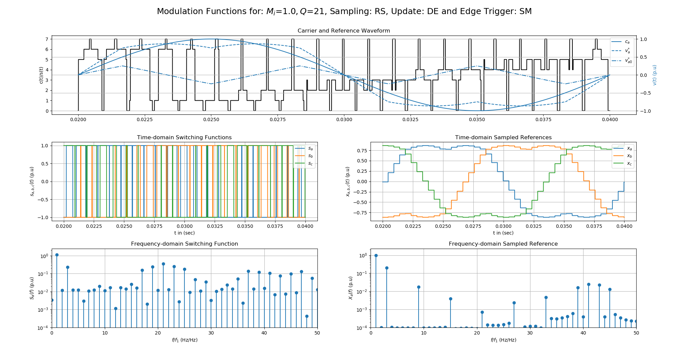
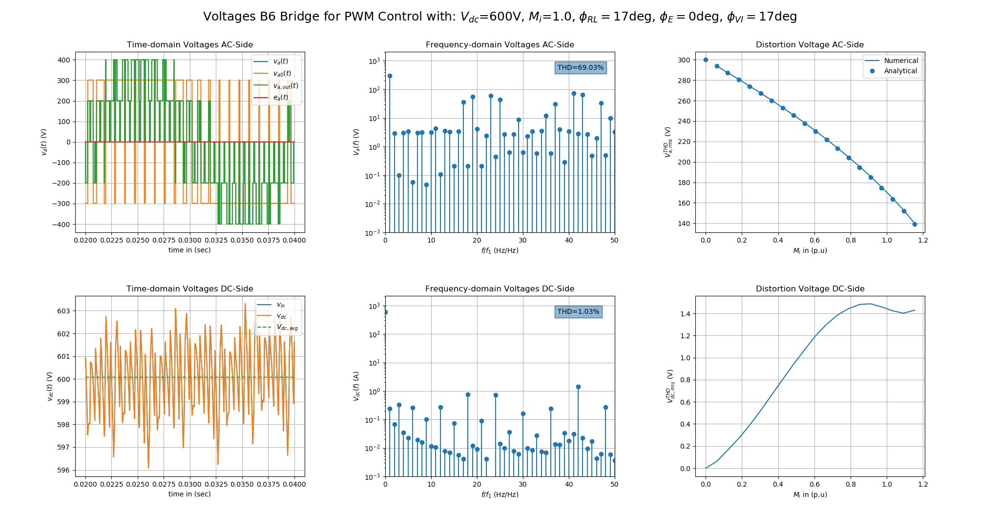

# PyPowerSim
PyPowerSim is a simple python toolkit for evaluation of standard power converter topologies.
The current version includes simulation architectures for a half-bridge (B2), a 
full-bridge (B4), and a three-phase full-bridge converter (B6) [1, 2]. The toolkit 
allows simple and fast calculation of power converter circuits including waveform, 
stead-state, and transient analysis using datasheet values of switching devices and 
DC-link capacitors. The aim is to illustrate the influence of PWM control methods 
to students and the interested reader without the use of commercial tools like SIMULINK, 
PLECs or LTSpice. It is clear, that this toolkit cannot be anywhere near the capabilities 
of commercial software but will hopefully provide a better understanding due to the freely 
available source code. The toolkit is obviously not complete; thus, suggestions are 
always welcome.

    
# Publication
The PyPowerSim toolkit is part of the following survey paper and tries to replicate 
the presented architectures and approaches. Please cite the following paper when 
using the PyPowerSim toolkit. When using the B6 architecture and the waveform analysis 
options please also refer to the following article:

Schirmer, Pascal A., Daniel Glose, and Ulrich Ammann. "Zero-voltage and frequency pattern 
selection for DC-link loss minimization in PWM-VSI drives." Electrical Engineering (2022): 1-10.

# Dependencies
The requirements of the PyPowerSim toolkit are summarized in the requirements.txt data file.
In detail, the PyPowerSim Toolkit was implemented using the following dependencies:
- Python 3.8
- Numpy 
- Pandas
- Scipy

The complete list of requirements and packages can be found in "requirements.txt".

# Limitations
Since the toolkit is still under development there are several things that need to be 
improved, are not yet implemented or lack verification with numerical models or measurements.
In the following a list of know issues and limitations is provided:
- The transfer functions for the input and output filter are not yet verified. Also, there is no protection against instability of the transfer functions.
- Soft switching architectures are not included yet.
- The interpolation methods for calculating the tabulated parameter options are only linear now.

# Architecture
The architecture implemented in the PyPowerSim toolkit is exemplary illustrated for a B2 
converter cell in Figure 1. The source code implementation of the PyPowerSim toolkit aims
to follow the data follow of the implementation in Figure 1 for the interested reader to
follow the data and signal flow path through the implementation. The complete description of the
toolkit can be found in \docu.

# Results
In the following chapter a set of reference results is provided using the B6 converter 
architecture and the default setup file. For a first test run use start.py to calculate 
the results presented below.

# Development
As failure and mistakes are inextricably linked to human nature, the toolkit is obviously not perfect, 
thus suggestions and constructive feedback are always welcome. If you want to contribute to the PyPowerSim 
toolkit or spotted any mistake, please contact me via: p.schirmer@herts.ac.uk

# License
The software framework is provided under the MIT license.

# Version History
1) v.0.0: (01.04.2023) Initial version of PyPowerSim
2) v.0.1: (16.06.2023) Major Update and housekeeping
    - Adding MOSFET devices
    - Revising switching loss calculation
    - Adding output control
3) v.0.2: (14.08.2023) Second major review and housekeeping
    - Adding thermal coupling
    - Bugfix switching sequence
    - General housekeeping
4) v.0.3: (13.10.2023) Third major review and housekeeping
    - Fixing steady-state simulation
    - General housekeeping
5) v.0.4: (01.12.2023) Fourth major review and housekeeping
    - Fixing bug in switching losses
    - Adding direct comparison with semiconductor datasheets
    - General housekeeping
   
# References
[1] Holmes, D. Grahame, and Thomas A. Lipo. Pulse width modulation for power converters: principles and practice. 
Vol. 18. John Wiley & Sons, 2003.

[2] Jenni, Felix, and Dieter Wüest. Steuerverfahren für selbstgeführte Stromrichter. vdf Hochschulverlag AG, 1995.
