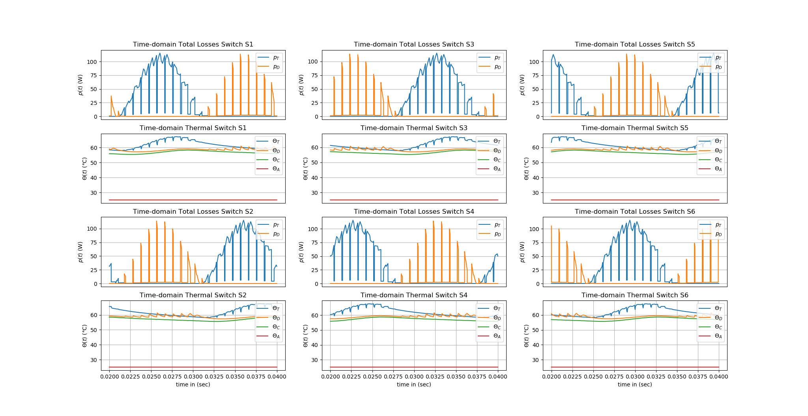
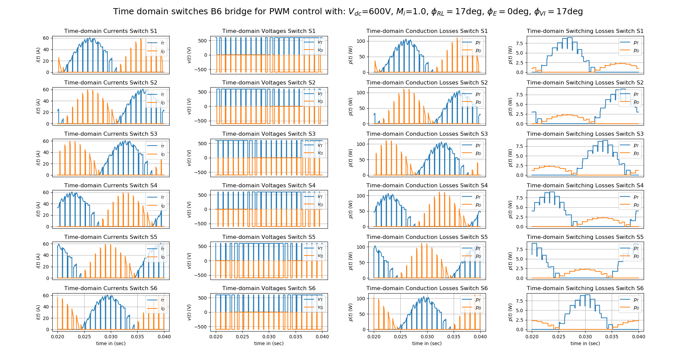
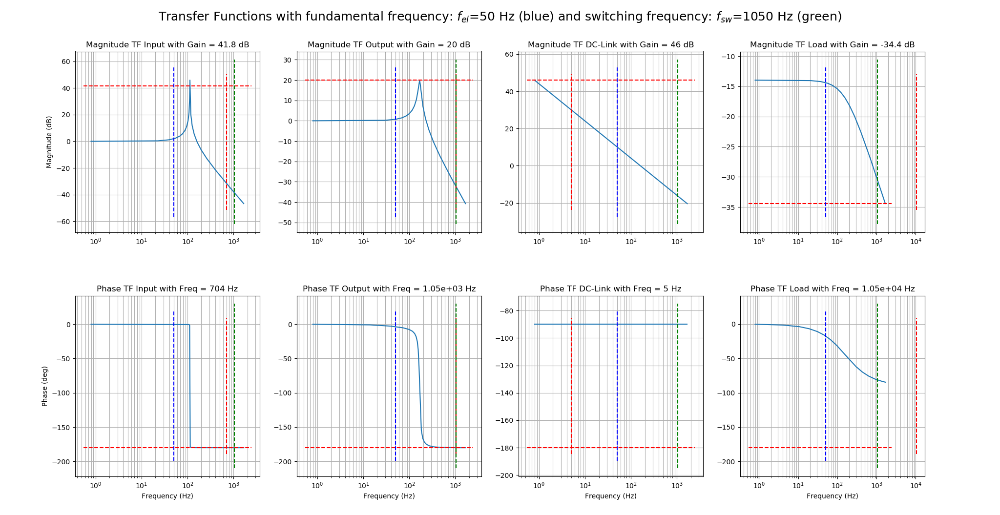
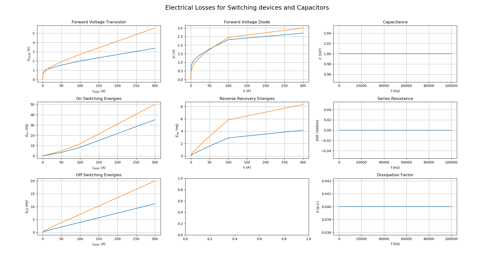
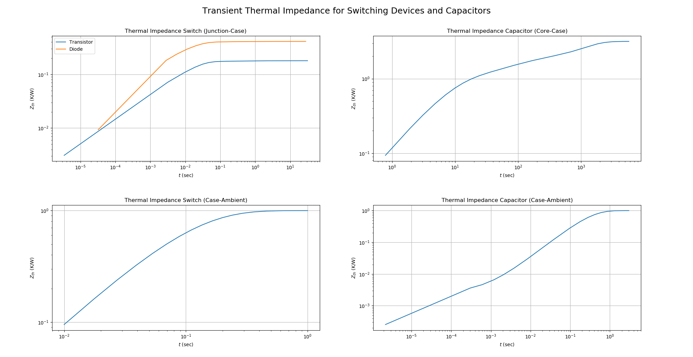

**Example Results and Explanations**
This page embeds example plots from `docu/images` and explains how to interpret them. The examples were generated using default configurations and are intended as a guide for reading plots, not a benchmark.

**1) Modulation Function (B6 Sweep Example)**
This figure shows the switching sequence and the modulation reference. The switching function generates high‑frequency pulses; the reference waveform indicates the target fundamental component.

What to look for:
1. Carrier and reference alignment.
2. Switching sequence symmetry over a fundamental period.
3. Spectral harmonics aligned to integer multiples of `f/f1`.

**2) Currents (B6 Sweep Example)**
This plot combines time‑domain and frequency‑domain representations and distortion‑versus‑modulation curves.

What to look for:
1. RMS current level in the time‑domain waveform.
2. Harmonic magnitudes in the spectrum.
3. THD trends vs. modulation index `M_i`.

**3) Voltages (B6 Sweep Example)**
This plot mirrors the current plot but for voltages. It highlights waveform shape and harmonic content.

What to look for:
1. DC‑link ripple in the time‑domain signal.
2. Dominant harmonics and their decay.
3. Voltage THD dependence on `M_i`.

**4) Steady‑State Losses and Temperatures**
These figures show conduction and switching losses and the corresponding thermal response.

What to look for:
1. Which devices dominate conduction losses.
2. Switching loss spikes aligned to transitions.
3. Temperature rise and steady‑state values.

**5) Model Inputs (Transfer Functions, Loss Models, Thermal Models)**
These plots document the underlying models used in the analysis.

What to look for:
1. Bode plot stability and bandwidth implications.
2. Loss model linearization ranges.
3. Thermal RC time constants and steady‑state values.
